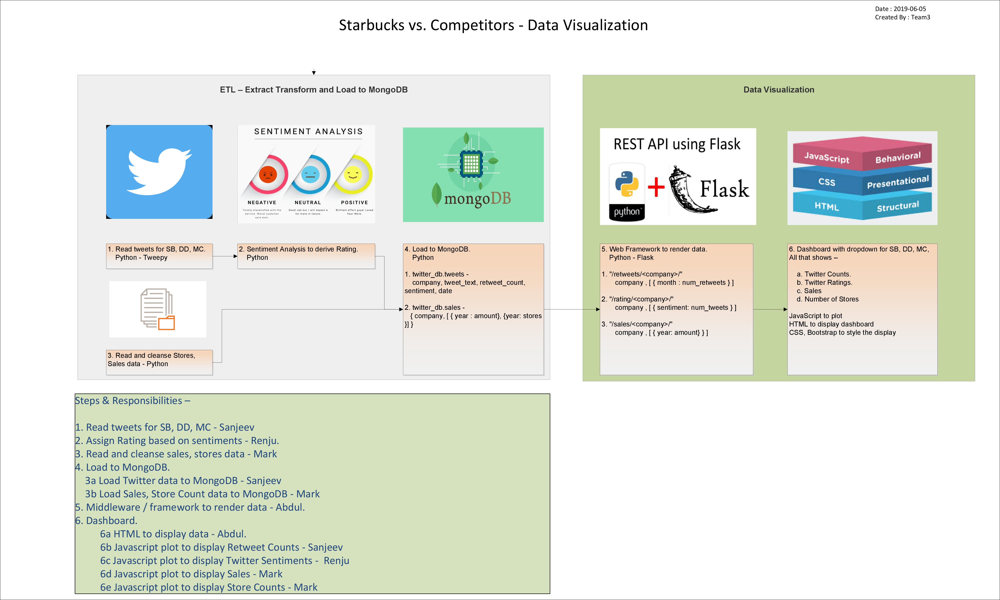

# Project 2

## Group Members

Renju, Abdul, Sanjeev, Mark

## Topic Overview

Our proposal is to analyze key retail competitors in the coffee sales business, specifically Starbucks, Dunkin Donuts, and McDonald’s.  We understand that target markets may vary. We plan to analyze how each company leverages social media, especially twitter to understand consumer opinions and help influence its growth. Studying the revenue growth and store growth also provide insights into the competitive environment.  We are going to collect data on each business including sentiment data scraped from Twitter and sales and store data from the businesses themselves.  All of this data will be stored in a Mongo db.  The results will be rendered using a Flask app on a dashboard that will display Twitter counts, Twitter ratings, sales data, and store data.  The dashboard will be switchable by a dropdown menu which will allow the user to choose which company they would like to see.

## Instructions for Running the App
1.  Run 'python import.py' from the root directory to import data from revenue and storecount csv file.
2.  Run 'python extract_tweets.py' also from the root directory to scrape twitter.
3.  Run 'python app.py' file to start the app and go to browser.

## Links to Datasets

Starbucks 10k
http://d18rn0p25nwr6d.cloudfront.net/CIK-0000829224/8684a23c-916a-4e4c-a98d-d0d5fa44d0a4.xls

Dunkin 10k
http://investor.dunkinbrands.com/static-files/a0bfec12-a3fe-481d-9270-8db8148045da

McDonalds 10k
http://d18rn0p25nwr6d.cloudfront.net/CIK-0000063908/7575454f-e767-4147-9fa1-a3e6fb5f1391.xls

Positive words
https://github.com/jeffreybreen/twitter-sentiment-analysis-tutorial-201107/blob/08a269765a6b185d5f3dd522c876043ba9628715/data/opinion-lexicon-English/positive-words.txt

Negative words
https://github.com/jeffreybreen/twitter-sentiment-analysis-tutorial-201107/blob/08a269765a6b185d5f3dd522c876043ba9628715/data/opinion-lexicon-English/negative-words.txt

## Sketches

